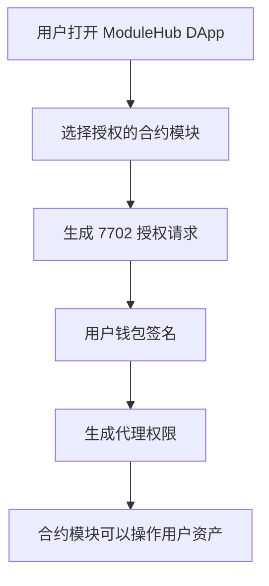
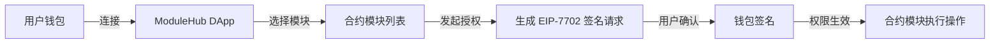

好的，我帮你整理一份 **适合 PPT 演示的 DApp 介绍文案**，包含你要求的五个方面，同时在涉及流程的地方用 **Mermaid 流程图**表示，让展示更直观。你可以直接放到 PPT 或文档里。

------

## 1️⃣ 产品简介

**ModuleHub（示例名）** 是一个基于 **EIP-7702 协议**的 DApp，允许用户：

- 自由授权不同的智能合约操作自己的钱包资产
- 实现钱包功能模块化拓展
- 安全、可控、灵活地管理多合约权限

**核心价值**：让钱包不再是单一工具，而是可以自由组合功能的“可扩展生态”。

------

## 2️⃣ 没有 7702 之前的痛点

- 钱包授权单一：每次使用新合约都要单独 Approve 或签名
- 用户体验差：频繁弹签名窗口，操作繁琐
- 难以实现代币多操作合一：无法批量授权或模块化管理
- 安全性难控制：无法灵活管理不同合约的权限

------

## 3️⃣ 有了 7702 之后实现的点

- **统一授权入口**：一次签名，可让多个合约在规则允许下操作钱包
- **灵活控制权限**：用户可随时添加/撤销合约授权
- **模块化扩展**：钱包可以按需接入新功能模块
- **提升用户体验**：减少频繁签名操作，提高操作效率

------

## 4️⃣ 我们这个 DApp 的原理

**核心逻辑**：

1. DApp 提供一个 UI，让用户选择要授权的合约模块
2. 构建 **EIP-7702 交易/签名请求**
3. 用户签名，钱包生成代理权限
4. 合约通过代理可以安全操作用户资产

**Mermaid 流程图示例**：

------

## 5️⃣ 我们的 DApp 去赋能钱包的流程

**用户视角流程**：

**流程说明**：

1. 用户连接钱包到 DApp
2. 在 DApp 选择希望授权的合约模块
3. DApp 构建 EIP-7702 授权请求
4. 用户钱包签名确认
5. 签名生效后，对应模块即可安全操作钱包资产