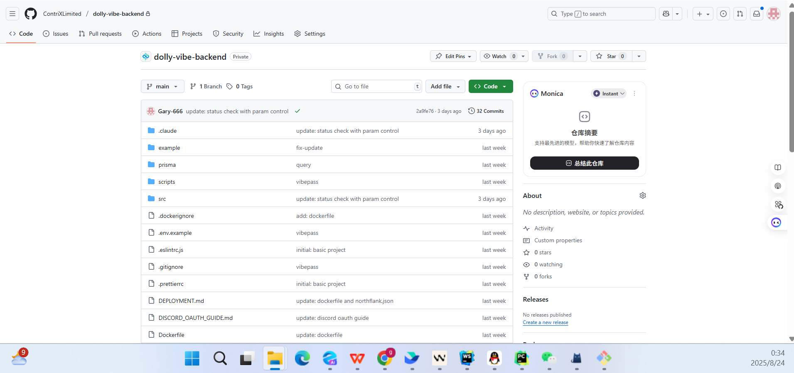
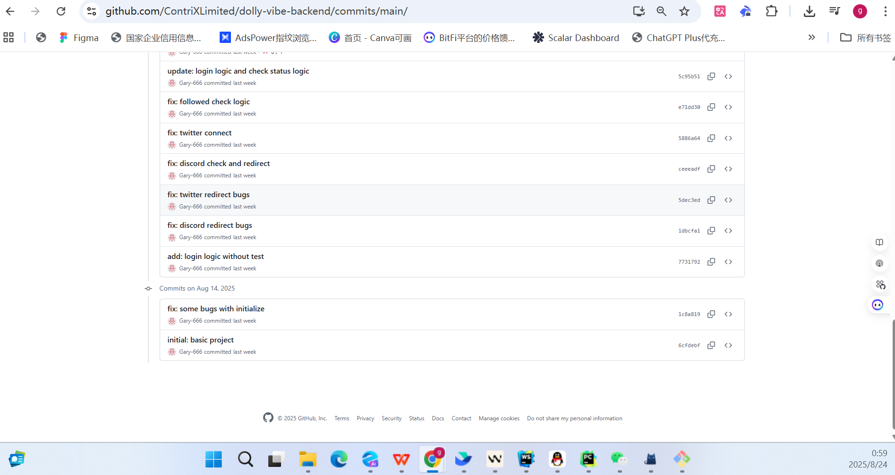
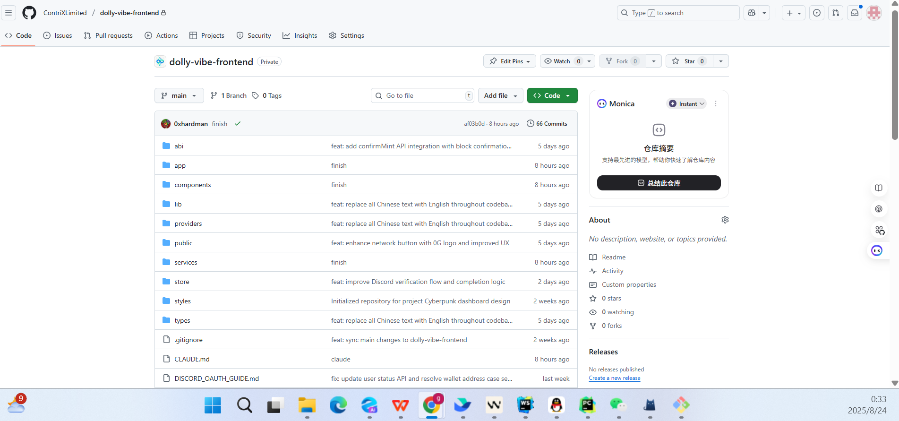
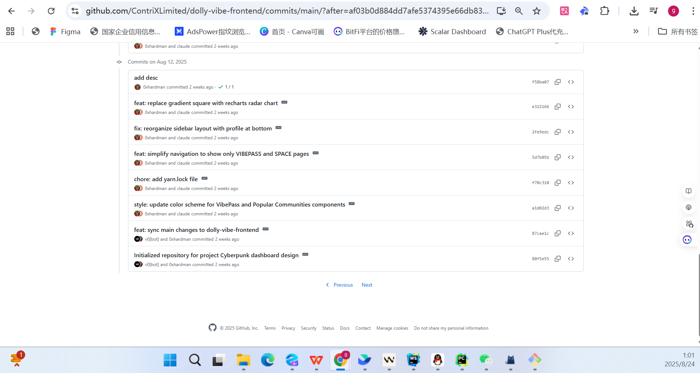

# DollyVibe 项目时间线证明

## 项目开发时间说明

DollyVibe 项目完全是在2025年8月开始开发的原创项目，以下是相关证据：

## GitHub 仓库创建时间

### 后端仓库

**关键信息：**
- 仓库创建时间：**2025年8月**
- 总提交数：32 commits
- 主要语言：Python (63.0%), TypeScript (37.0%)
- 仓库地址：https://github.com/ContriXLimited/dolly-vibe-backend

### 前端仓库  

**关键信息：**
- 仓库创建时间：**2025年8月**
- 总提交数：66 commits  
- 主要语言：TypeScript (87.9%), HTML (10.3%)
- 仓库地址：https://github.com/ContriXLimited/dolly-vibe-frontend

## 项目开发历程

- **2025年8月**: 项目启动，创建前端和后端代码仓库，开始核心功能开发
- **2025年8月**: 持续开发，实现 iNFT、VibePass、多维度评分系统等核心功能
- **2025年8月下旬**: 完成主要功能开发，准备参加 ETH Shenzhen 2025 Hackathon

## 验证方式

由于项目仓库目前为私有状态，可以通过以下方式验证项目的开发时间：

1. **GitHub 截图证据**: 上述截图清楚显示了仓库的创建时间、提交历史和开发活动
2. **评委会验证**: Hackathon 评委可以申请临时访问权限查看完整的代码仓库和提交历史
3. **项目演示**: 通过在线演示地址和视频展示项目的实际功能和开发成果
4. **团队成员证明**: 团队成员的 GitHub 活动记录可以作为开发时间的间接证明

这些证据充分说明 DollyVibe 是一个在规定时间内（2025年8月）开始开发的合规项目。