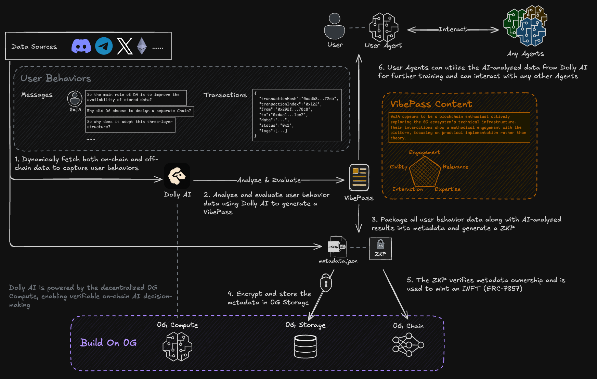
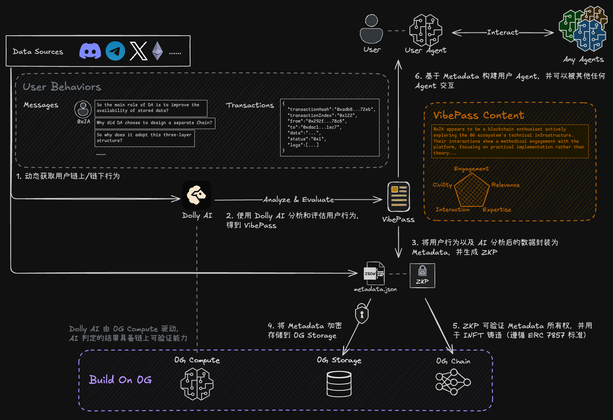

# DollyVibe

## 项目概述

DollyVibe 不仅是一个用户参与度评估系统，更是一个革命性的 "Human Interface designed for Agents" —— 让人类能够向任意 Agent 展示"我是谁"的标准化解决方案。该项目通过将用户的链上行为、社区贡献、社交互动转化为可验证的数字身份资产，解决 Agent 缺乏用户上下文的核心痛点，推动Web3与AI的深度融合。

## 项目所选赛道

**Innovative Dapps**: 创新应用类赛道

## 核心功能

1. **智能身份资产化（iNFT）**: 将用户的链上行为、社区贡献、社交互动转化为可验证的 iNFT（ERC-7857），构建可携带、可交易的数字身份资产

2. **选择性身份披露（VibePass）**: 用户通过 VibePass 卡包，根据不同场景需求选择性展示身份属性 —— DeFi场景展示信用记录，求职场景展示专业技能，实现隐私保护下的身份验证

3. **多维度行为评分系统**: 通过五大维度（参与度、相关性、专业度、互动性、文明度）实时评估用户行为，生成动态更新的信誉积分，为 Agent 决策提供量化依据

4. **Agent 互操作协议**: 支持 MCP、A2A、ADP 等多种协议，让用户身份在不同 Agent 生态间无缝流转，解决 Agent 缺乏用户上下文的核心痛点

5. **去中心化身份市场（Agent Playground）**: 用户 Agent 可在竞技场展示能力并发行 Key，其他用户通过购买 Key 雇佣 Agent 服务，形成"用钱投票"的声誉经济系统

## 技术架构

### 核心技术流程

1. **数据收集与分析**
   - 动态获取链上和链下数据源（Discord、Telegram、X/Twitter、Ethereum等）
   - 捕获用户行为数据，包括消息、交易等多维度信息

2. **AI 驱动的行为评估**
   - 使用 Dolly AI 分析和评估用户行为数据
   - 生成包含五大维度（参与度、相关性、专业度、互动性、文明度）的 VibePass

3. **零知识证明与隐私保护**
   - 将用户行为数据和AI分析结果打包到元数据中并生成ZKP
   - 确保用户隐私的同时提供可验证的身份证明

4. **0G 生态集成**
   - 利用 0G Storage 进行元数据的去中心化存储
   - 通过 0G Compute 实现可验证的链上AI决策
   - 基于 0G Chain 铸造 iNFT (ERC-7857)

5. **Agent 互操作性**
   - ZKP验证元数据所有权并用于铸造iNFT
   - 用户Agent可利用Dolly AI分析的数据进行进一步训练
   - 支持与任意其他Agent的无缝交互

6. **VibePass内容展示**
   - 基于区块链爱好者的实际行为生成个性化身份标签
   - 多维度评分系统提供量化的用户画像
   - 支持选择性披露，适应不同应用场景需求

## 代码仓库地址

- **前端**: [https://github.com/ContriXLimited/dolly-vibe-frontend](https://github.com/ContriXLimited/dolly-vibe-frontend)
- **后端**: [https://github.com/ContriXLimited/dolly-vibe-backend](https://github.com/ContriXLimited/dolly-vibe-backend)

## 团队成员 List

- **Samuel - CEO**: [https://github.com/samuelzey](https://github.com/samuelzey)  
  6年经验web3产品经理，曾在Solv, Bigtime Studios任职，曾是百度Dudulab项目的产品负责人，携程NFT产品的技术顾问。

- **0xja - CTO**: [https://github.com/0xja-eth](https://github.com/0xja-eth)  
  Web3+AI 行业连续创业者，12年开发经验，资深黑客松玩家，获得过十余项国际黑客松奖项。曾是百度、华润区块链项目的技术负责人。

- **Summer - CMO**: [https://github.com/summerisstunning](https://github.com/summerisstunning)  
  周周黑客松（6000+开发者的AI社区）联合创始人，SKY旗下Spark.fi的亚太社区负责人，曾在世界500强企业主导了数亿元人民币的产品销售。

- **GaryMa - AI解决方案开发**: [https://github.com/Gary-666](https://github.com/Gary-666)  
  AI连续创业者，上段创业开发的AI销售与获客系统服务过遇见小面，丽颖丽驻兰，国台酒，凡科网等著名企业。

- **0xhardman - Web3解决方案开发**: [https://github.com/0xhardman](https://github.com/0xhardman)  
  资深web3开发者，LXDAO（国内头部的Web3开发者社区）核心成员，主导了温铁军带领的公平田野项目的区块链升级。

## 历史获奖说明

- **0G*web3labs Grant**: 入选孵化器

## Deck (PPT) 地址

[https://docs.google.com/presentation/d/1-EZNDSo0emzJt-j9phglGge8MDw8RGNWOqlHDo5IbXE/edit?usp=sharing](https://docs.google.com/presentation/d/1-EZNDSo0emzJt-j9phglGge8MDw8RGNWOqlHDo5IbXE/edit?usp=sharing)

## 项目演示

- **演示视频**: [https://www.youtube.com/watch?v=Rei9Rnu9owg](https://www.youtube.com/watch?v=Rei9Rnu9owg)
- **在线体验地址**: [https://dolly-vibe-frontend.vercel.app/](https://dolly-vibe-frontend.vercel.app/)