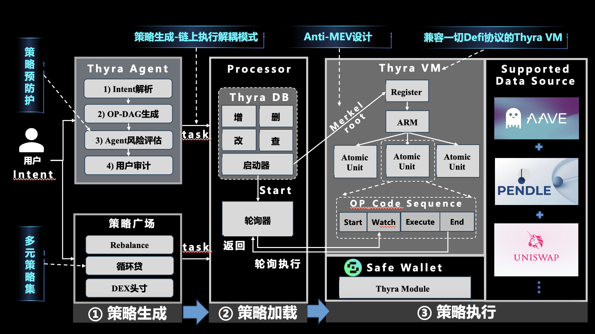

## 项目概述

Thyra 是一个面向终端用户的 AI 驱动 DeFi 自动化与编排钱包。愿景是成为用户的“私人基金经理”：用户仅需极简设置，即可“设好就忘”，持续、可控地获取安全收益。我们通过“策略生成-策略加载-策略执行”三段式架构，将智能、灵活与安全统一在同一产品内。

## 项目所选赛道（只能选一个）
- xFi（已选）：金融类应用/协议赛道。Thyra 以策略化的自动化投研与执行为核心，强调安全与收益并重，天然契合 xFi 的金融创新与普惠目标。

## 痛点洞察
### 面向用户
- 链上交互复杂：步骤多、签名频繁、资产与风险分散，难以“设好就忘”。
- 钱包设计僵化：仅提供转账/签名能力，缺少策略化与自动化编排能力。

### 面向竞品
- 安全性难以保证：Agent 直接控私钥、缺少权限白名单与原子回滚，出错代价高。
- 灵活性难以保证：协议覆盖有限、策略不可组合/复用，难以随市场快速迭代。

## 解决方案与架构（概览）

- 策略生成｜Thyra Agent（智能核心）
  - 预定义 70+ DeFi 工具，将自然语言转为可执行有向无环图。
  - 已覆盖 Aave、Pendle、Uniswap，可自由组合任意策略形态。
  - 可从"策略广场"一键复用高质量策略模板。
- 策略加载｜Thyra DB（安全中间件）
  - 我们的安全核心：彻底解耦"Agent 生成"与"链上执行"。
  - 用户保留最终策略决定权：可审计、可复核、可动态修改；执行严格按用户批准的 DAG 进行。
  - 杜绝"Agent 幻觉"直控私钥的风险，提供权限白名单与变更追踪。
- 策略执行｜Thyra VM（链上并行策略 VM）
  - 图灵完备的 DeFi 执行 VM：一次部署，兼容海量策略与协议形态。
  - 将策略抽象为 DAG 的原子操作序列，内置 opcode 与原子提交（END_ATOMIC）语义。
  - 直接读取链上数据，支撑高频、近零延迟的执行体验。

## 核心功能（5 条）
- 自然语言 → DAG 策略编排，配合“策略广场”即取即用。
- 强大工具集，多协议自由组合。
- 策略加载与安全治理：解耦、审计、白名单与动态更新。
- 近零延迟与高频执行：链上数据直读，面向高频场景优化。
- 原子执行与失败回滚：原子组提交点，保障一致性与安全。

## 差异化亮点
- 近 0 延迟执行：链上直读数据，友好支持高频策略。
- 原子级安全：每个操作均可原子提交与回滚，防止半完成状态。
- 图灵完备并行策略 VM：可升级、可扩展、跨协议通用。

## 代码仓库地址
https://github.com/Oblivionis214/Thyra-monorepo

## 团队成员 List（名字、GitHub）
- Grey 2452499850@qq.com，
- Ryan He 1933548839ab@gmail.com ，
- 许留山 2855020996@qq.com，
- light 781387197@qq.com ，
- BetaCat hao_xu@tju.edu.cn

## 历史获奖说明
- 无，比赛开始前两周开始开发。

## Deck（PPT）地址
- 在线链接：https://docs.google.com/presentation/d/15t6VZSQzKuX3fE-tAGt3e3NXQ3kq97Vc6Myy08U6eWY/edit?usp=sharing

## 项目演示

- 路演视频：https://drive.google.com/file/d/1G4P6EtC_gA9yEUivNqQM6iwFYORL9Q1J/view?usp=sharing
- 在线 Demo（如有）：https://drive.google.com/file/d/1jj22gD_lgplfHyh8-TPB_JtZTR1doDk6/view?usp=sharing

---

## 附：组件文档
- Thyra Agent与 API：`ThyraCore/README.md`（详见 `COMPREHENSIVE_GUIDE.md`）
- 合约（只读数据）：`contracts/README.md`
- Thyra Frontend：`ThyraFrontend/README.md`
- Thyra VM 设计：`ThyraVM/DeFi_VM_Technical_Design.md`
