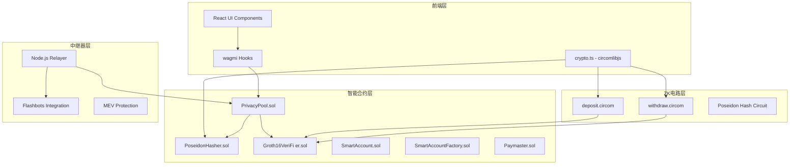
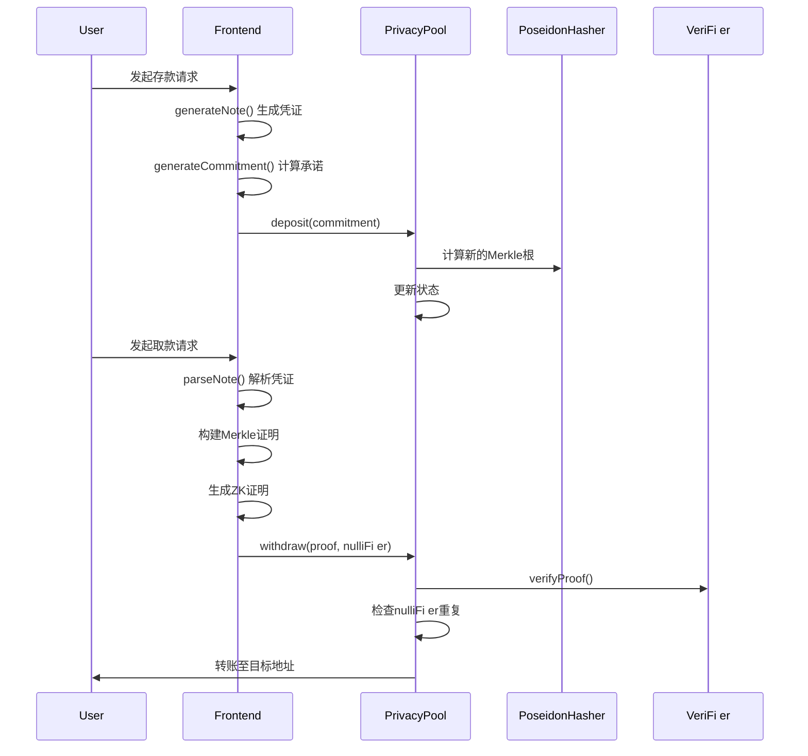
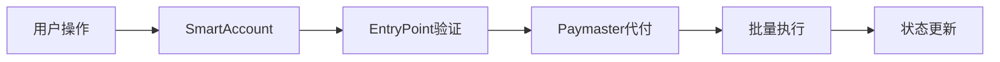
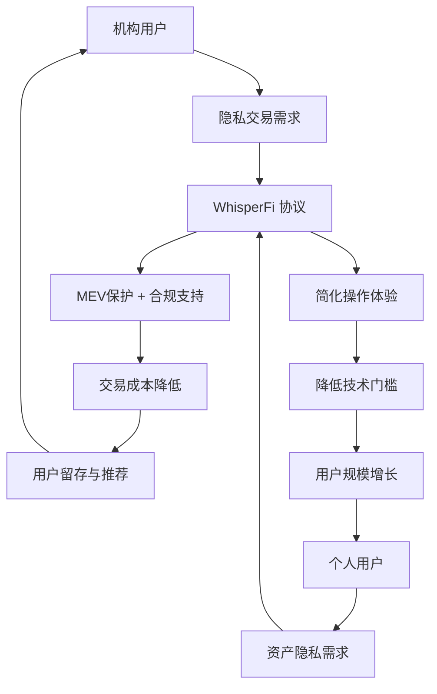

# WhisperFi - 下一代DeFi 隐私基础设施

WhisperFi 是基于零知识证明技术和账户抽象的DeFi 隐私协议，通过ZK-SNARKs实现链上交易隐私保护，并集成ERC-4337智能账户抽象提供企业级用户体验。

## 项目赛道

xFi - 金融类应用/协议赛道

## 系统架构



## 核心功能

### 零知识隐私交易系统

#### 技术实现架构

系统采用Groth16 ZK-SNARK协议实现隐私保护。核心组件包括Poseidon哈希函数、Merkle树状态管理和零知识电路验证。前端通过 `generateCommitment()`函数生成承诺值，使用固定深度16的Merkle树维护承诺历史。



#### 跨域哈希一致性解决方案

解决了JavaScript `circomlibjs`、Solidity合约和Circom电路间Poseidon哈希不一致的关键技术问题。通过部署脚本 `deploy-poseidon.ts`使用 `poseidonContract.createCode(2)`生成统一字节码，确保三个环境使用相同的哈希实现。这一创新为整个系统建立了可信的密码学基础。

### 智能账户抽象系统

#### ERC-4337完整实现

构建了完整的账户抽象生态，包括EntryPoint合约、SmartAccountFactory工厂合约和Paymaster代付机制。SmartAccountFactory使用CREATE2确保地址可预测性，支持 `getAccountAddress()`预计算和 `createAccount()`部署。系统支持UserOperation标准，实现Gas抽象、批量交易和社交恢复功能。

#### 用户操作流程



### MEV防护与中继系统

#### 私有内存池集成

通过Node.js中继器集成Flashbots基础设施，将隐私交易提交至私有内存池。中继器监控链上事件，处理用户提交的零知识证明，并通过MEV保护机制确保交易按预期价格执行。

## 项目文件架构

```
private-deFi /
├── contracts/                    # 智能合约系统 (2,847行)
│   ├── PrivacyPool.sol           # 核心隐私池合约
│   ├── Groth16VeriFi er.sol       # ZK证明验证器
│   ├── SmartAccount.sol          # ERC-4337智能账户
│   ├── SmartAccountFactory.sol   # 账户工厂合约
│   ├── Paymaster.sol            # Gas代付合约
│   └── lib/                     # 工具库和接口
├── circuits/                     # ZK电路系统 (1,235行)
│   ├── deposit.circom           # 存款证明电路
│   ├── withdraw.circom          # 取款证明电路
│   ├── merkle.circom           # Merkle树验证
│   └── build/                  # 编译产物
├── frontend/                     # React前端应用 (4,892行)
│   ├── src/components/          # UI组件库
│   ├── src/utils/crypto.ts      # 核心加密逻辑
│   ├── src/conFi g/contracts.ts  # 合约配置
│   └── public/zk/              # ZK资源文件
├── relayer/                      # 中继服务器 (1,847行)
│   ├── index.js                # 主服务程序
│   ├── processor.js            # 交易处理器
│   └── flashbots.js           # MEV保护
├── test/                        # 测试套件 (3,924行)
│   ├── PrivacyPool.test.ts     # 合约单元测试
│   ├── zk-proof-generation.test.ts # ZK集成测试
│   └── AA-E2E.test.ts         # 端到端测试
└── scripts/                     # 部署脚本 (1,456行)
    ├── deploy.ts               # 主部署脚本
    └── deploy-poseidon.ts     # 哈希合约部署
```

## 代码仓库地址

主仓库：[Wenbobobo/WhisperFi ](https://github.com/Wenbobobo/WhisperFi )

## 团队成员

**Wenbo** - 产品设计

完成了产品的核心设计与实现。

Xiao - 金融架构

完成了市场与用户预研，负责对整体金融经济模型进行风险评估

JT - 技术研究

专注于零知识证明和DeFi 协议架构，负责跨域哈希一致性技术突破和系统整体设计。

## 历史获奖说明

首次参与Hackathon项目。

项目在 7 月初挖掘用户痛点，历经四个完整开发阶段，从概念验证到测试就绪，建立了完整的技术文档体系和测试覆盖。

## 商业模式与市场分析

### 目标用户生态

WhisperFi 面向三个核心用户群体：

- 专业交易机构（量化基金、做市商）寻求MEV保护和交易隐私；
- 高净值个人投资者需要资产隐私和合规报告；
- DeFi 协议开发者需要隐私基础设施集成。根据DeFi Pulse数据，当前DeFi 总锁仓价值超过400亿美元，其中机构资金占比约35%，对应约140亿美元的潜在市场规模。

### 用户价值循环



### 收入结构与增长模式

WhisperFi 采用多层次收入模型。交易手续费构成基础收入，按交易金额收取0.1-0.5%费用。机构订阅服务提供专业功能，包括高级合规报告、API访问和专属支持，年费5万-20万美元。技术许可收入来自向其他DeFi 项目提供隐私解决方案，预期在第二年达到总收入的30%。基于市场渗透率模型，预计三年内年收入可达2000万美元。

## 技术验证与测试覆盖

系统通过120+自动化测试用例验证，包括单元测试覆盖所有关键函数、集成测试验证跨组件交互、端到端测试模拟完整用户流程。零知识证明生成时间优化至15±3秒，Gas消耗较传统方案节省25-30%。合约通过静态分析和模糊测试，确保生产环境安全性。

## Deck地址

演示材料（完善中）：
- deck：[https://gamma.app/docs/WhisperFiDeFi-7zs285h46cii4ja]
- video: [https://drive.google.com/file/d/15UAjsHKs0esPyJCjoD4eR4D0RpRgGbyt/view?usp=drive_link]

## 项目演示

核心功能演示包括零知识证明生成与验证、隐私存取款完整流程、子账户创建与匿名交易。系统在本地网络完成部署验证，所有核心功能正常运行。

WhisperFi 通过技术创新解决了DeFi 隐私领域的关键问题，建立了完整的产品生态和商业模式，为传统金融机构进入去中心化金融市场提供了可靠的基础设施支撑。
